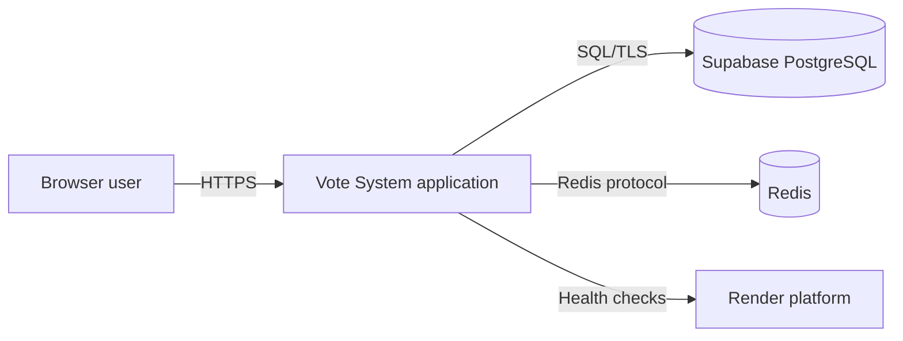
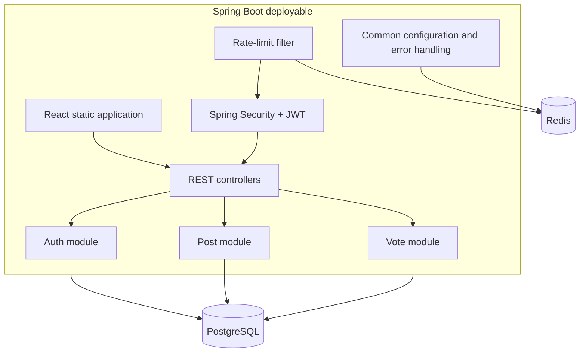
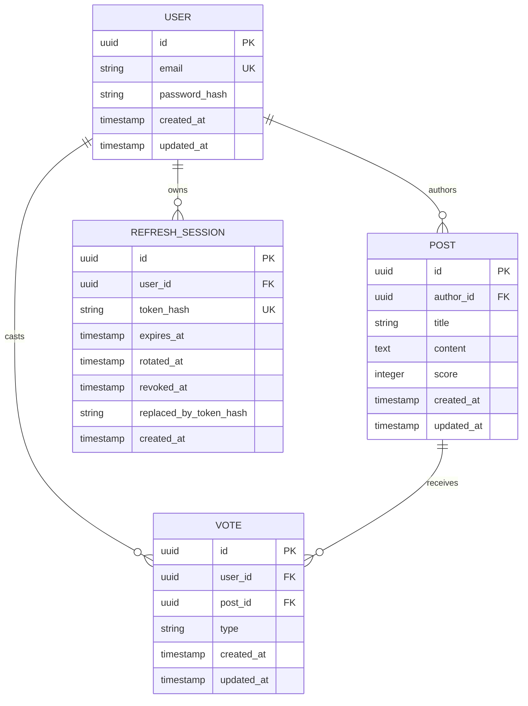
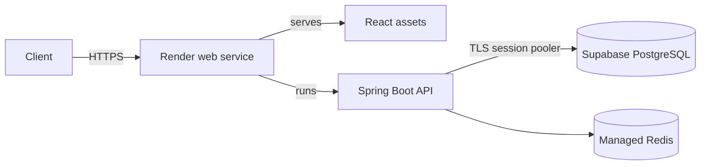

# Vote System — Technical Design

**Status:** Living document  
**Applies to:** `main` architecture as extended by PR #11  
**Last updated:** 2026-07-24

## 1. Purpose

Vote System is a production-oriented voting platform implemented as a modular monolith. The current design optimizes for low operational cost and strong transactional consistency while preserving clear domain boundaries so selected modules can later be extracted into services.

This document describes the implemented architecture, runtime flows, persistence model, security model, operational behavior, failure modes, testing strategy, and scale-out path. API usage is documented separately in [`API.md`](API.md).

## 2. Scope

### Implemented

- User registration and login
- Signed short-lived JWT access tokens
- Rotating opaque refresh-token sessions
- Refresh-token replay detection
- Post creation, browsing, search, update, and deletion
- Post ownership enforcement
- Upvote, downvote, vote change, and vote removal
- One vote per user and post
- Atomic score adjustment
- PostgreSQL persistence with Flyway migrations
- Redis-backed sliding-window rate limiting
- Redis cache foundation
- Actuator health checks
- React frontend with optimistic vote updates
- Single-container production delivery through Render
- OpenAPI 3 and Swagger UI

### Planned but not implemented

- Hot ranking backed by Redis
- Transactional outbox and domain-event delivery
- WebSocket or SSE result fan-out
- Dedicated observability dashboards and SLO alerts
- Service extraction and per-service databases

## 3. Architectural drivers

1. **Correct vote totals:** vote state and post score must remain consistent.
2. **Secure sessions:** raw refresh tokens must never be persisted.
3. **Low-cost deployment:** frontend and backend can run as one deployable unit.
4. **Evolution without premature distribution:** domain boundaries exist before microservices.
5. **Controlled abuse:** authentication, post creation, and vote mutation are rate limited.
6. **Operational resilience:** Redis policy may fail open where availability is preferred over throttling.

## 4. System context



The browser loads the React application and calls the same origin under `/api/v1`. Spring Boot serves static frontend assets and REST endpoints. PostgreSQL is the source of truth. Redis is supporting infrastructure for rate limiting, caching, and future ranking/realtime fan-out.

## 5. Container architecture



### Runtime ordering

For protected requests, the request passes through Spring Security and JWT authentication. The rate-limit filter runs after bearer-token authentication so user-scoped rules can use the authenticated subject. Controllers then delegate to domain services and repositories.

## 6. Module boundaries

### `auth`

Owns users, password verification, access-token issuance, refresh sessions, rotation, revocation, and replay handling.

### `post`

Owns post lifecycle, browsing/search, ownership checks, pagination, and exposed post projections.

### `vote`

Owns per-user vote state and score changes. It may reference post and user identifiers but should not expose its repository to other controllers.

### `ratelimit`

Owns rule selection, client/user identity selection, Redis Lua execution, retry calculation, and rate-limit metrics.

### `common`

Owns cross-cutting configuration, security wiring, Redis configuration, standardized errors, and shared infrastructure concerns.

### Boundary rule

Controllers must not reach into another module's repository. Cross-domain behavior should be expressed through service methods or explicit application-level ports. This rule is the main protection against a future extraction becoming a rewrite.

## 7. Data model

The exact column definitions are controlled by Flyway migrations. The conceptual model is:



### Invariants

- User email is unique.
- A user has at most one vote for a post.
- Vote type is restricted to supported values such as `UP` and `DOWN`.
- Post score equals the aggregate effect of active votes.
- Raw refresh tokens never enter PostgreSQL.
- Expired, revoked, or rotated refresh sessions cannot issue a new access token.
- Deleting a post removes dependent votes within the same transaction.

## 8. Authentication and authorization

### Access token

- Signed JWT using HS256
- Default lifetime: 15 minutes
- Sent as `Authorization: Bearer <token>`
- Validated statelessly by Spring Security
- Issuer validation is enabled
- Secret must contain at least 32 bytes

### Passwords

Passwords are hashed with BCrypt using strength 12. Password hashes are never returned by API responses.

### Refresh token

- Opaque cryptographically random value
- Stored in an `HttpOnly` cookie
- Cookie is path scoped to authentication endpoints
- Secure-cookie behavior is environment controlled
- Only the SHA-256 hash is persisted

### Refresh rotation

```mermaid
sequenceDiagram
    participant B as Browser
    participant A as Auth API
    participant DB as PostgreSQL

    B->>A: POST /api/v1/auth/refresh + cookie T1
    A->>A: SHA-256(T1)
    A->>DB: Load active session for hash(T1)
    DB-->>A: Session S1
    A->>DB: Mark S1 rotated; create S2 with hash(T2)
    A-->>B: Access JWT + HttpOnly cookie T2
```

The validation and rotation update must execute transactionally. A repeated use of T1 after rotation is interpreted as replay. The defensive response is to revoke all active refresh sessions for that user.

### Authorization rules

- Register, login, refresh, logout, health, public post reads, Swagger UI, and OpenAPI documents are publicly reachable.
- Post creation and mutation require authentication.
- Only the post author may update or delete it.
- Vote mutation requires authentication.
- Logout-all requires a valid access token.

## 9. Vote consistency model

Vote writes are strongly consistent against PostgreSQL.

### Supported transitions

| Existing vote | Requested action | Score delta |
|---|---|---:|
| none | UP | +1 |
| none | DOWN | -1 |
| UP | DOWN | -2 |
| DOWN | UP | +2 |
| UP | delete | -1 |
| DOWN | delete | +1 |
| same type | same type | 0 |

The vote row mutation and post score adjustment must occur in one database transaction. The unique `(user_id, post_id)` constraint is the final concurrency guard. Application checks improve error quality but do not replace the constraint.

### Concurrency risk

Two concurrent requests for the same user and post can race before insert. The database unique constraint must reject the duplicate. The service should translate the resulting persistence exception into a stable response or retry the transition by re-reading current state.

### Frontend reconciliation

The React UI applies an optimistic score/vote update. The server response remains authoritative. On failure, the UI rolls back or replaces its optimistic state with the returned server state.

## 10. Redis design

### Current uses

- Sliding-window rate limiting using a sorted set per rule and subject
- Shared cache manager with JSON values
- Actuator Redis health integration

### Rate-limit key shape

```text
rate:<rule>:<subject>
```

Examples:

```text
rate:login:203.0.113.10
rate:vote:user@example.com
```

The limiter executes an atomic Lua script that removes expired entries, checks the count, appends the current request, refreshes TTL, and returns allow/deny plus retry timing.

### Failure policy

`app.rate-limit.fail-open=true` allows requests when Redis is unavailable. This preserves API availability but temporarily removes abuse protection. Production environments with stronger abuse requirements may set fail-open to false, accepting that Redis failure can reject protected operations.

### Trust boundary warning

Client IP currently derives from the servlet request remote address. When deployed behind proxies, forwarded headers must only be trusted when the proxy chain is controlled and Spring proxy/header handling is configured. Never blindly trust arbitrary `X-Forwarded-For` values from public clients.

## 11. API design

- Base path: `/api/v1`
- JSON request and response bodies
- Bean Validation for request constraints
- Swagger UI: `/swagger-ui.html`
- OpenAPI JSON: `/v3/api-docs`
- OpenAPI YAML: `/v3/api-docs.yaml`

Protected operations use the OpenAPI `bearerAuth` scheme. API details and interactive usage are in [`API.md`](API.md).

### Error contract

Errors should use `application/problem+json` and include at least:

```json
{
  "type": "about:blank",
  "title": "Too Many Requests",
  "status": 429,
  "detail": "Rate limit exceeded. Retry after 42 seconds",
  "instance": "/api/v1/posts/123/vote",
  "timestamp": "2026-07-24T12:00:00Z"
}
```

Validation, authentication, authorization, conflict, not-found, and rate-limit errors should follow one stable shape. Error responses must not expose stack traces, SQL, secrets, password hashes, or refresh-token material.

## 12. Transactions

Transactions are required around:

- Registration where multiple persisted records are created
- Refresh-token rotation
- Replay-triggered session revocation
- Vote create/change/delete plus score update
- Post deletion plus dependent vote cleanup

Read-only browsing and search should use read-only transactions where useful. Long network or Redis calls must not be performed while holding database transactions unless explicitly justified.

## 13. Deployment architecture



The production image builds React first and copies the output into Spring Boot static resources. This avoids CORS configuration and simplifies the initial deployment.

### Required secrets

- `DB_URL`
- `DB_USERNAME`
- `DB_PASSWORD`
- `JWT_SECRET`
- `REDIS_URL` when Redis is attached

Secrets, full connection strings, raw refresh tokens, and database credentials must not be committed.

## 14. Health and observability

### Implemented

- `/actuator/health`
- Database health indicator
- Optional Redis health indicator
- Micrometer counters for rate-limit allow, reject, and error outcomes
- CI build logs and test reports uploaded as diagnostics

### Required next step

Add request latency, error-rate, authentication-failure, vote-conflict, database-pool, and Redis latency dashboards. Define service-level indicators before adding autoscaling or realtime fan-out.

## 15. Testing strategy

### Unit tests

- Vote transition delta matrix
- Refresh-token hashing and validation
- Ownership policy
- Rate-limit rule resolution
- OpenAPI metadata and security scheme

### Integration tests

Use Testcontainers for PostgreSQL and Redis to verify:

- Flyway migrations
- Unique vote constraint
- Transaction rollback on vote failures
- Refresh rotation and replay revocation
- Rate-limit allow/reject behavior
- Security access rules
- Public Swagger/OpenAPI endpoints

### API tests

MockMvc tests should cover success, boundary, and failure paths including malformed JWT, expired JWT, invalid cookie, duplicate email, unknown post, non-owner mutation, repeated vote, Redis outage, and `429 Retry-After`.

### Frontend tests

Verify optimistic update, rollback, stale response ordering, auth expiry, empty states, and mobile rendering.

## 16. Security considerations

- JWT signing secret must be high entropy and rotated through deployment configuration.
- Access tokens remain valid until expiry even after refresh-session revocation; short TTL limits this window.
- Refresh cookies should be `Secure` in production and use an appropriate `SameSite` policy.
- Login and registration responses must not reveal whether sensitive account state exists beyond intended product behavior.
- Rate-limit subjects must avoid storing raw credentials or tokens in Redis keys.
- Swagger exposure in production is currently intentional. Restrict it by profile or network policy if the API becomes private.
- Dependency and container vulnerability scanning should be added to CI.

## 17. Failure modes

| Dependency/failure | Current behavior | Risk | Mitigation |
|---|---|---|---|
| PostgreSQL unavailable | Business requests fail | Full write/read outage | Health check, connection timeout, managed backups |
| Redis unavailable with fail-open | Requests proceed without throttling | Abuse window | Alert on limiter errors; restore Redis |
| Redis unavailable with fail-closed | Limited endpoints fail | Availability loss | Use only when protection is more important |
| JWT secret changed | Existing access tokens fail | Forced re-login | Planned rotation and communication |
| Refresh-token replay | All sessions for user revoked | User disruption | Security event logging and re-authentication |
| Concurrent vote race | Unique constraint may reject one request | Transient conflict | Stable conflict handling or retry |
| Score drift from defect/manual SQL | Displayed score differs from votes | Integrity defect | Reconciliation job/query and immutable audit events |

## 18. Evolution path

### Near term

1. Complete consistent problem-details handling.
2. Add Redis hot ranking as a derived view, not the source of truth.
3. Add outbox events for vote/post changes.
4. Add reconciliation checks for score drift.
5. Add metrics dashboards and load tests.
6. Introduce SSE only after measuring the need for realtime delivery.

### Service extraction criteria

Extract a module only when at least one condition is demonstrated:

- Independent scaling requirements
- Independent release cadence
- Clear team ownership
- Isolation required for security or reliability
- Database workload materially interferes with other modules

Suggested extraction order when justified:

1. Ranking/read model
2. Realtime fan-out
3. Authentication/session management
4. Vote write service

Database separation happens with extraction, not before. Cross-service consistency should then use events/outbox and idempotent consumers rather than distributed transactions.

## 19. Key decisions

- Modular monolith before microservices
- PostgreSQL as the business source of truth
- One shared database for the current deployable
- JWT access tokens plus rotating opaque refresh tokens
- Database-enforced vote uniqueness
- Transactional vote and score updates
- Redis Lua sliding-window limiter
- Same-origin frontend/API deployment

See the ADRs under [`docs/adr`](adr/).

## 20. Known gaps and weakest links

1. The document describes conceptual entity fields; Flyway migrations remain authoritative for exact schema names and types.
2. Score consistency depends on all write paths using the transactional vote service. Administrative/manual SQL can violate the invariant.
3. Fail-open rate limiting deliberately trades abuse resistance for availability.
4. Access-token revocation is not immediate because JWT validation is stateless.
5. Realtime delivery is not implemented; optimistic UI is not equivalent to server push.
